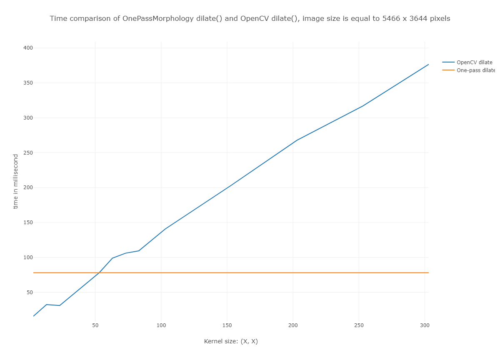

This repository contains an implementation of the one-pass dilatation algorithm described in 
**_Van Herk, Marcel. "A fast algorithm for local minimum and maximum filters on rectangular and octagonal kernels." Pattern Recognition Letters 13.7 (1992): 517-521._**

Naive implementation takes *`NMkl`* operations and an algorithm complexity is equal to *`O(NMkl)`*, where *`N x M`* - image size and *`k x l`* - kernel size. One-pass morphological algorithm takes *`6NM`* operations and doesn't depend on kernel size. So the algorithm complexity of the one-pass dilatation is equal to *`O(NM)`*.

An important property of morphological filters is separableness. A 2D morphological filters can be performed as two independent 1D the same morphological filters by each row and by each column with kernel width and kernel height, respectively.

Theoretical gain between these two implemintations hardly achieved in practice due to different processor optimizations, such as sequential memory access, Intrinsic functions and etc. The naive dilatation algorithm allows to use sequential memory access and works very fast for small kernels. The one-pass dilatation algorithm doesn't have opportunity to use a sequential memory access for row and column filters simultaneously. This repository contains a fast implementation based on a sequential memory access and Intrinsic functions for the columns dilatation, and the rows dilatation is calculated as the columns dilatation for a transposed image.

**Time comparison of OnePassMorphology and OpenCV implementations**

Time comparison was conducted for the one-pass and OpenCV implementations used Intrinsic functions. The result is shown in the image below. The experiment was conducted on a Core i7-4700HQ processor without thread parallelization. The x-axis is the size of a square kernel.

    

